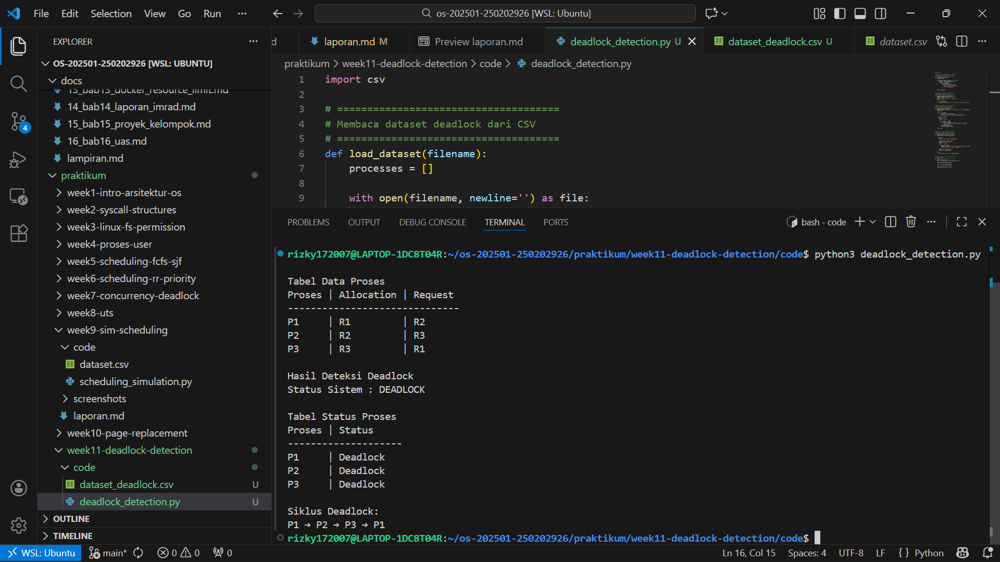

# Laporan Praktikum Minggu 14
Topik: Penyusunan Laporan Praktikum Format IMRAD

---

## Identitas
- **Nama**  : Rizky Iqbal Hisyam  
- **NIM**   : 250202926 
- **Kelas** : 1IKRA

---

## Judul
# Analisis Praktikum Deadlock Detection

---

## 1. Pendahuluan (Introduction)
### 1.1 Latar Belakang

Sistem operasi bertanggung jawab dalam mengelola sumber daya komputer agar dapat digunakan secara efisien oleh berbagai proses. Dalam lingkungan multitasking, proses-proses sering kali saling berbagi sumber daya seperti memori, prosesor, dan perangkat input/output. Pengelolaan sumber daya yang tidak tepat dapat menimbulkan permasalahan serius, salah satunya adalah deadlock, yaitu kondisi ketika dua atau lebih proses saling menunggu sumber daya yang sedang dipegang oleh proses lain sehingga tidak ada proses yang dapat melanjutkan eksekusi (Silberschatz et al., 2018).

Deadlock terjadi apabila empat kondisi terpenuhi secara bersamaan, yaitu mutual exclusion, hold and wait, no preemption, dan circular wait. Dalam sistem yang kompleks dan dinamis, mencegah atau menghindari deadlock secara total sering kali tidak praktis karena dapat membatasi pemanfaatan sumber daya. Oleh karena itu, pendekatan deadlock detection digunakan dengan membiarkan deadlock terjadi dan kemudian mendeteksinya melalui mekanisme tertentu (Tanenbaum & Bos, 2015).

### 1.2 Rumusan Masalah
1. Bagaimana mekanisme deteksi deadlock dalam sistem operasi?

2. Mengapa deadlock dapat terjadi berdasarkan hubungan alokasi dan permintaan sumber daya?

3. Bagaimana hasil deteksi deadlock dikaitkan dengan teori empat kondisi deadlock?


## 2. Metode (Methods)
### 2.1 Lingkungan Uji
Praktikum ini dilakukan pada sistem operasi berbasis Linux (WSL Ubuntu) menggunakan bahasa pemrograman Python. Program dijalankan melalui terminal dengan interpreter Python untuk mensimulasikan proses deteksi deadlock.

### 2.2 Langkah Eksperimen
Langkah eksperimen deadlock-detection sebagai berikut:
1. Sesuaikan struktur folder seperti berikut:
```
praktikum/week11-deadlock-detection/
├─ code/
│  ├─ deadlock_detection.py
│  └─ dataset_deadlock.csv
├─ screenshots/
│  └─ hasil_deteksi.png
└─ laporan.md
```
2. Siapkan dataset berisi daftar proses, resource allocation, dan resource request.
   | Proses | Allocation | Request |
   |:--:|:--:|:--:|
   | P1 | R1 | R2 |
   | P2 | R2 | R3 |
   | P3 | R3 | R1 |
3. Implementasi Algoritma Deteksi Deadlock (program harus membaca data proses dan resource, menentukan sistem deadlock atau tidak, menampilkan proses mana yang terlibat deadlock).
4. Jalankan program dengan dataset melalui terminal, gunakan command python3 karena melalui OS Linux/WSL 


### 2.3 Dataset
Dataset yang digunakan terdiri dari beberapa proses dan resource, di mana setiap proses memegang satu resource dan meminta resource lain. Konfigurasi ini dirancang untuk membentuk siklus ketergantungan antar proses.

   | Proses | Allocation | Request |
   |:--:|:--:|:--:|
   | P1 | R1 | R2 |
   | P2 | R2 | R3 |
   | P3 | R3 | R1 |


### 2.4 Cara Pengukuran
Pengukuran dilakukan secara kualitatif dengan mengamati hasil keluaran program, yaitu status setiap proses (deadlock atau tidak), serta kesimpulan sistem apakah terjadi deadlock atau tidak.

## 3. Hasil (Result)
### 3.1 Tabel Hasil Praktikum
| Proses | Status   |
| ------ | -------- |
| P1     | Deadlock |
| P2     | Deadlock |
| P3     | Deadlock |

Hasil simulasi menunjukkan bahwa sistem berada dalam kondisi deadlock, di mana seluruh proses terlibat dalam siklus ketergantungan sumber daya.

### 3.2 Screenshots Hasil
Berikut bukti hasil eksperimen:


## 4. Pembahasan
### 4.1 Interpretasi Hasil

Hasil praktikum menunjukkan bahwa circular wait merupakan indikator utama terjadinya deadlock. Proses-proses tidak dapat melanjutkan eksekusi karena masing-masing menunggu sumber daya yang tidak dapat dilepaskan oleh proses lain.

### 4.2 Keterbatasan Praktikum

Simulasi ini masih menggunakan skenario sederhana dengan satu instance untuk setiap jenis resource. Selain itu, program hanya melakukan deteksi deadlock tanpa menerapkan mekanisme pemulihan seperti penghentian proses atau preemption sumber daya.

### 4.3 Kesesuaian dengan Teori

Hasil praktikum sesuai dengan teori deadlock dalam sistem operasi, di mana deadlock terjadi ketika keempat kondisi deadlock terpenuhi secara bersamaan. Simulasi berhasil memvalidasi konsep deadlock detection secara praktis.

## 5. Penutup
### 5.1 Kesimpulan
Berdasarkan praktikum yang telah dilakukan, dapat disimpulkan bahwa deadlock detection merupakan pendekatan yang efektif untuk mengidentifikasi deadlock setelah kondisi tersebut terjadi. Deadlock muncul akibat terpenuhinya empat kondisi deadlock, khususnya adanya circular wait antar proses. Melalui simulasi ini, konsep deadlock detection dapat dipahami secara lebih konkret dan sesuai dengan teori sistem operasi.

### 5.2 Quiz
1. Mengapa format IMRAD membantu membuat laporan praktikum lebih ilmiah dan mudah dievaluasi?  
   **Jawaban:** <br> Format IMRAD membantu menyusun laporan secara sistematis dan logis, mulai dari tujuan, metode, hingga hasil dan analisis. Dengan struktur ini, pembaca atau dosen dapat dengan mudah menilai apakah metode yang digunakan sudah tepat, hasilnya valid, dan kesimpulannya sesuai dengan data, sehingga laporan menjadi lebih ilmiah dan objektif.
2. Apa perbedaan antara bagian **Hasil** dan **Pembahasan**?  
   **Jawaban:** <br> Bagian Hasil menyajikan data atau keluaran eksperimen secara objektif tanpa interpretasi, seperti tabel atau status deadlock. Sedangkan Pembahasan menjelaskan makna dari hasil tersebut, mengaitkannya dengan teori, serta membahas penyebab, implikasi, dan keterbatasan praktikum.
3. Mengapa sitasi dan daftar pustaka penting, bahkan untuk laporan praktikum?  
   **Jawaban:** <br> Sitasi dan daftar pustaka penting untuk menunjukkan bahwa praktikum didasarkan pada teori dan referensi yang jelas, bukan opini pribadi. Selain itu, sitasi membantu menghindari plagiarisme, meningkatkan kredibilitas laporan, dan memudahkan pembaca menelusuri sumber teori yang digunakan.

## Daftar Pustaka
Silberschatz, A., Galvin, P. B., & Gagne, G. (2018). *Operating System Concepts* (10th ed.). Wiley.

Tanenbaum, A. S., & Bos, H. (2015). *Modern Operating Systems* (4th ed.). Pearson.